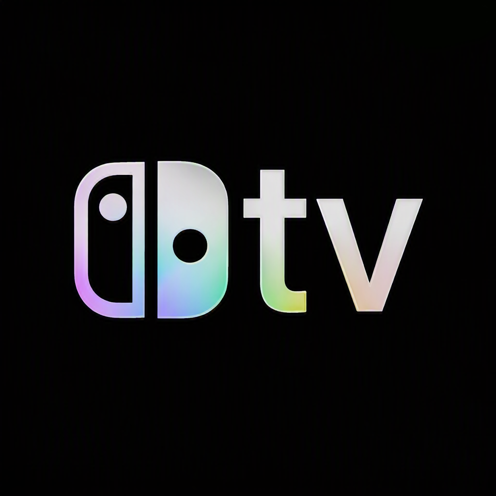
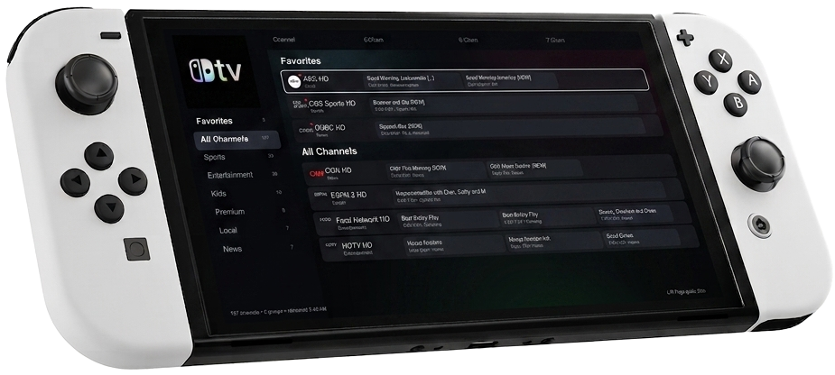

<p align="center">
    
</p>

<h1 align="center">PocketTV</h1>

<p align="center">
  Live TV for Nintendo Switch homebrew, with M3U playlists, XMLTV guide data, channel logos, favorites, and a compact Apple TV-inspired guide.
</p>

<div align="center">


</div>

<div align="center">


</div>

<br>

<p align="center">

</p>

## Highlights

- M3U playlist support for live channels.
- XMLTV EPG support with a persistent EPG URL setting.
- 90-minute Live TV guide with 30-minute columns and L/R guide paging.
- Channel logos from playlist metadata, with compact fallback labels when logos are unavailable.
- Favorites pinned above the full channel list and marked with a small heart.
- App-style dark theme with a subtle aurora background behind the guide.
- Existing live playback path preserved from the upstream project.

## Playlist And EPG Privacy

PocketTV does not include a private playlist or EPG URL by default. Add your own M3U and XMLTV EPG addresses inside the app from the Live TV settings.

The app does not host or provide IPTV content. Users are responsible for ensuring their playlists contain only legal and authorized streams.

For a subscription-gated service, use the Cloudflare Worker proxy in [docs/premium-proxy.md](docs/premium-proxy.md). It keeps upstream playlist and EPG URLs in secrets and gives PocketTV public proxy URLs instead.

The signup website for a 7-day trial and $9.99/month Premium plan is in [website/premium-signup](website/premium-signup), with the matching Stripe Checkout API in [workers/signup-api](workers/signup-api).

## Nintendo Switch

1. Download the latest PocketTV release.
2. Copy `PocketTV.nro` to the `switch` folder on your SD card.
3. Launch hbmenu with full application memory, then open PocketTV.
4. Open Live TV settings and enter your M3U playlist URL and optional XMLTV EPG URL.

## Build

The Switch build uses the repository's existing devkitPro path:

```shell
docker run --rm -v $(pwd):/data devkitpro/devkita64:latest \
  bash -lc "cd /data && scripts/build_switch.sh"
```

The generated app is `PocketTV.nro` in the Switch build directory.

## Attribution

PocketTV is based on TsVitch by giovannimirulla and keeps the original GPL-3.0 license.

This project builds on open source work from devkitPro, switchbrew, borealis, mpv, FFmpeg, wiliwili, nlohmann/json, CPR, OpenCC, lunasvg, libwebp, and related dependencies included in the upstream project.
